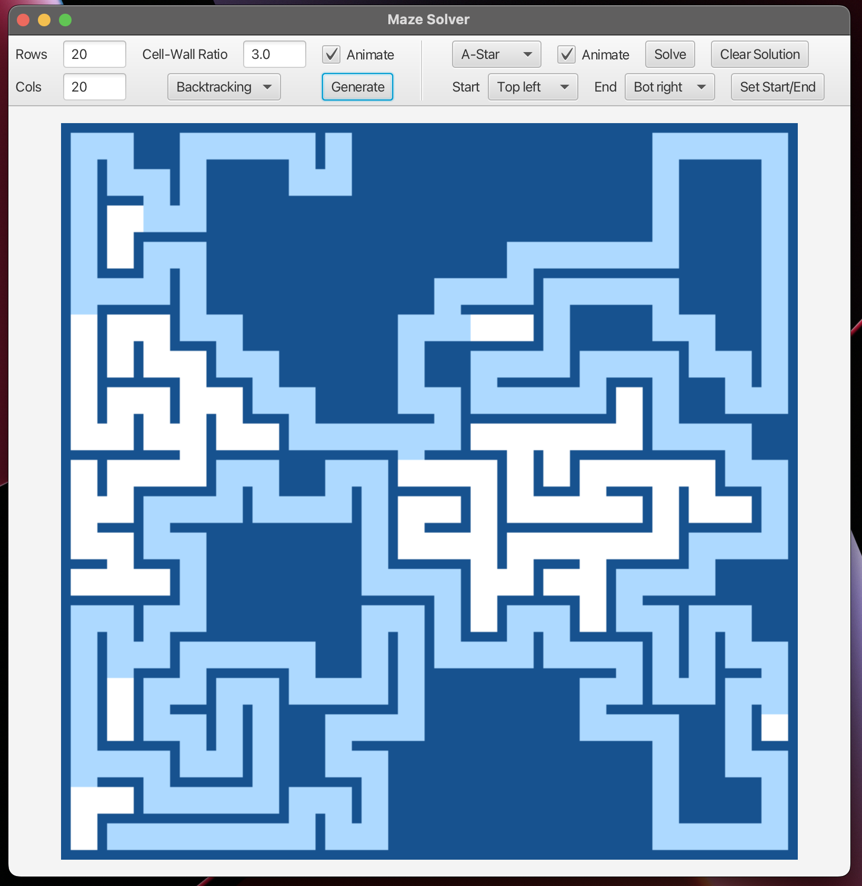
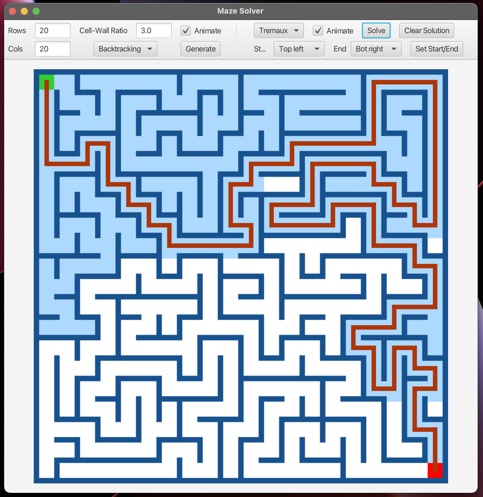

# mazeproject

`MazeProject` is a set of maze solving and generating algorithms in Java. It comes with a fully-featured GUI for maze visualization. MazeProject was developed as part of a project in CSC 345 at the University of Arizona.

In this project we implement various maze generation and solving algorithms, we  explored complex theoretical concepts in a practical setting, using manipulated data structures like priority queues, union-finds, and graph traversal methods such as BFS, DFS, and A-Star. Developed a GUI client for visualizing algorithms showcasing interface design and system integration.

    <figure>
        
        <figcaption>Generating mazes</figcaption>
    </figure>
    <figure>
        
        <figcaption>Solving mazes</figcaption>
    </figure>

## Running `MazeProject`

To run with Maven in VSCode:

1. Make sure you have Java JDK 22 Downloaded.

2. Install Apache Maven: https://maven.apache.org/install.html (Any other way works, such as in MacOS with Homebrew)

3. Clone the project into a directory on your computer.

4. Navigate to the project in the terminal with `cd path/to/project`.

5. Run `mvn clean install`

5. To run the `JavaFX` gui, run `mvn clean javafx:run`.

6. To run the `Main` class, run `mvn clean exec:java`
